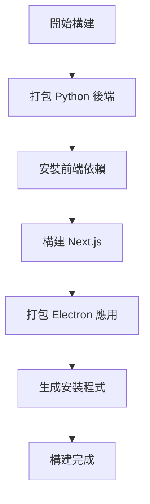

# Supervisor Agent 打包說明

## 🎯 目標
將 Supervisor Agent 前後端專案打包成單一可執行的桌面應用程式，用戶只需雙擊即可啟動完整的應用。

## 📋 前置需求

### 必要軟體
1. **Python 3.8+** - 用於後端服務
2. **Node.js 16+** - 用於前端構建
3. **Yarn** - 前端包管理器
4. **PyInstaller** - Python 打包工具

### 安裝 PyInstaller
```bash
pip install pyinstaller
```

## 🚀 快速開始

### 方法一：一鍵構建（推薦）
```bash
# 執行完整構建腳本
scripts\build-app.bat
```

### 方法二：分步構建
```bash
# 1. 構建後端
scripts\build-backend.bat

# 2. 構建前端
cd frontend
yarn install
yarn build
yarn build:electron
```

## 🔧 開發模式

如果你想在開發模式下測試：
```bash
# 啟動開發環境（前後端同時啟動）
scripts\start-dev.bat
```

## 📁 構建輸出

構建完成後，你會在以下位置找到可執行文件：
- **安裝程式**: `frontend/dist/Supervisor Agent Setup.exe`
- **便攜版**: `frontend/dist/win-unpacked/Supervisor Agent.exe`

## 🎮 使用方式

1. **安裝版本**: 雙擊 `Supervisor Agent Setup.exe` 安裝後使用
2. **便攜版本**: 直接雙擊 `Supervisor Agent.exe` 即可使用

## 🔍 故障排除

### 常見問題

**Q: 後端啟動失敗**
- 檢查是否正確安裝了所有 Python 依賴
- 確認 `supervisor-agent-backend.exe` 是否存在於 `frontend/electron/backend/` 目錄

**Q: 前端構建失敗**
- 執行 `yarn install` 重新安裝依賴
- 檢查 Node.js 版本是否符合要求

**Q: 應用啟動後無法連接後端**
- 檢查防火牆設置
- 確認端口 8000 沒有被其他程式佔用

### 日誌查看
- 開發模式：控制台會顯示詳細日誌
- 生產模式：檢查 Electron 開發者工具（Ctrl+Shift+I）

## 📦 打包原理

1. **後端打包**: 使用 PyInstaller 將 Python 應用打包成單一可執行文件
2. **前端構建**: Next.js 構建靜態文件，Electron 包裝成桌面應用
3. **整合**: Electron 主進程管理後端服務的生命週期
4. **分發**: electron-builder 創建安裝程式

## 🔄 自動化流程



## 📝 注意事項

1. **首次構建時間較長**: PyInstaller 需要分析所有依賴
2. **文件大小**: 打包後的應用約 200-300MB（包含 Python 運行時）
3. **跨平台**: 目前配置針對 Windows，如需其他平台請修改相關配置
